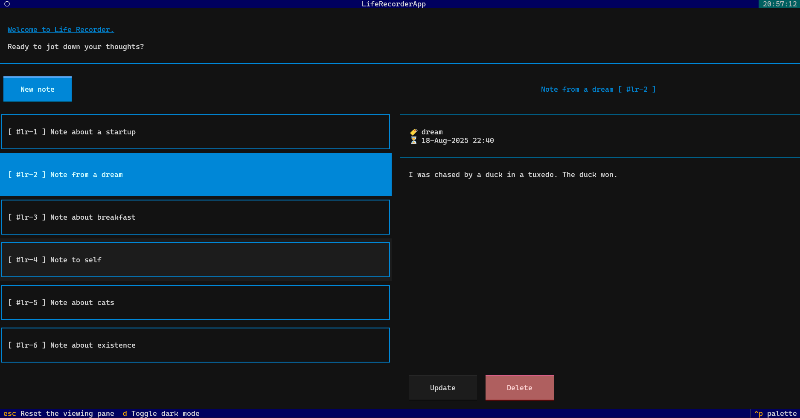

# Life Recorder

A CLI based approach to save records. Records can be categorized with tags.

> Records are saved locally in the specified directory by user. JSON file format is used to save records.

[TOC]

> DISCLAIMER: This assumes that you have Python 3.8 or above is installed.

## Installation

```bash
git clone https://github.com/khasizadaj/life_recorder.git

cd life_recorder

pip install .
```

## Usage

You can either use CLI or use terminal app. After installing library you get access to two new executable: `life_recorder` and `life_recorder-app`

`life_recorder` is CLI executable that let's you perform CRUD operations:

```shell
$ life_recorder read lr-1
Id: #lr-2
Timestamp: 18-Aug-2025 22:40
Tag: dream
Title: Note from a dream
Content: I was chased by a duck in a tuxedo. The duck won.
```

`life_recorder-app` is terminal app that let's you visualize your your notes from terminal with UI or navigate using your keyboard.

```shell
$ life_recorder-app
```



> [!info] Note: Each option uses the same database, i.e. JSON file, however offers different interface to interact with it.

> [!info] Note: Terminal app was built with [Textual](https://github.com/textualize/textual).


### Commands

- `create`
- `read`
- `read <identifier>`
- `update <identifier>`
- `delete <identifier>`

#### create

This command adds a new record to the database.

User needs to provide these inputs to create new record:

- `<tag>` (optional)
- `<title`
- `<content>`

```shell
$ life_recorder create

  # user inputs
  What is the tag of record (optional)?: <tag>
  What is the title of record? <title>
  What is the content of this record? <content>

  # output
  Record added successfully:

  id: <identifier>
  timestamp: <timestamp>
  tag: <tag>
  title: <title>
  content: <content>
```

> `<identifier>` and `<timestamp>` are generated by program automatically.

#### read

This command can be used with or without providing an identifier. If it is without any identifier, it will read and print all existing records in the database.

```shell
$ life_recorder read

  # output
  id: <identifier>
  timestamp: <timestamp>
  tag: <tag>
  title: <title>
  content: <content>

  id: <identifier>
  timestamp: <timestamp>
  tag: <tag>
  title: <title>
  content: <content>

  ...

```

However, if user provides an identifier for command, it will read and print record that has specified identifier in the database.

```shell
$ life_recorder read <correct_identifier>

  # output
  id: <correct_identifier>
  timestamp: <timestamp>
  tag: <tag>
  title: <title>
  content: <content>

```

#### update

This command always requires an identifier to perform the operation. It takes an identifier and prints record for user to remind what was the record; then asks to update any fields that can be updated, i.e. title, tag, content.

```shell
$ life_recorder update <identifier>

  # reminder
  Current record:

  id: <identifier>
  timestamp: <timestamp>
  tag: <tag>
  title: <title>
  content: <content>

  Usage: Add new detail for respective field. If you want to keep any value untouched, press "Enter".

  # user inputs
  What is the updated tag? (optional): <new_tag>
  What is the updated title?: <new_title>
  What is the updated content?: <new_content>

  # output
  Record with #1 is updated.

```

> User can keep any field as it is by providing no new detail and pressing `Enter`. This information is displayed for user as well.

#### delete

This command always requires an identifier to perform the operation. It takes an identifier and prints record for user to remind what is the record; then it asks the user to confirm deletion of record. If user confirms, it will delete it.

```shell
$ life_recorder update <identifier>

  Record you want to delete is:
  id: <identifier>
  timestamp: <timestamp>
  tag: <tag>
  title: <title>
  content: <content>

  Are you sure you want to delete this record? [Y(y) / N(n)]:

  # user confirms deletion by writing "y" or "Y"
  Deleting record ... Don't stop adding new records!

  Successfully deleted record.

  # user aborts deletion by writing "n" or "N"
  Every record matters! I am glad that you didn't delete it!

```

### Development

To run tests, run the following command:

```bash
$ poetry install --with dev
$ poetry run python -m unittest discover -v -s tests -p 'test_*.py' --failfast
```
